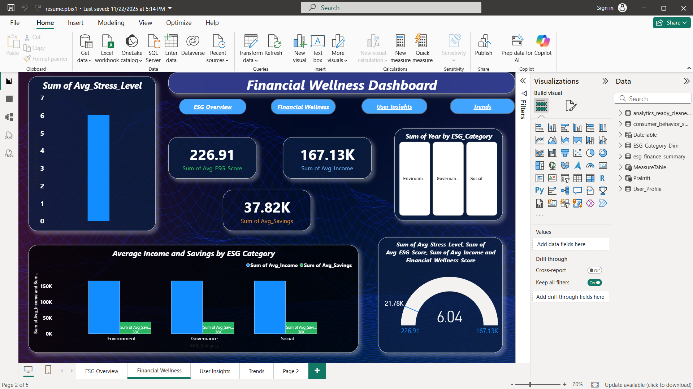
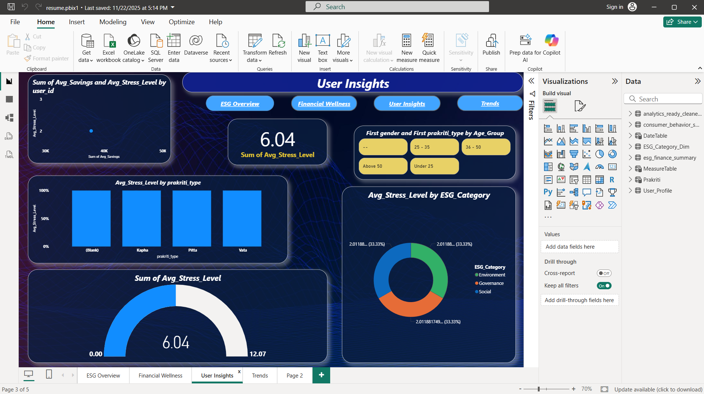
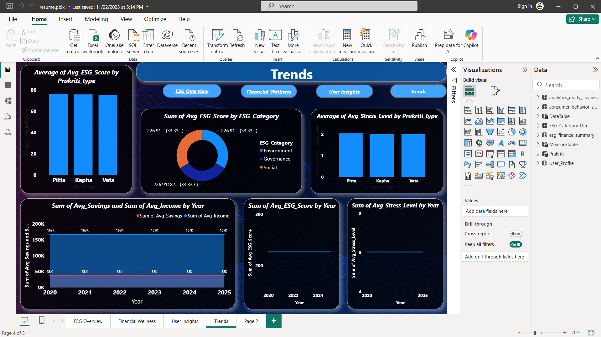

# 🌱 Cross-Domain ESG–Prakriti Financial Wellness Analyzer

---

## 1. 📌 About the Project
This project explores **financial wellness from a behavioral and sustainability-driven perspective** by integrating  
**ESG principles (Environmental, Social, Governance)** with **Prakriti-based behavioral profiling**.

Instead of evaluating financial health only through income, expenses, or savings, this project focuses on **how human behavior and sustainability awareness shape financial decisions over time**.

The objective is simple:  
to transform raw financial and behavioral data into **clear, actionable insights** that support **long-term, responsible financial well-being**.

This project brings together **finance, behavioral analytics, ESG concepts, and data visualization** into a single, practical analytics solution.

---

## ⚡ Project Snapshot

- **Domain:** Financial Analytics, ESG, Behavioral Analytics  
- **Role:** Data Analyst  
- **Skills Used:** Python, Pandas, NumPy, Power BI, Data Modeling, EDA  
- **Output:** Financial wellness scoring model + interactive dashboards  
- **Business Use:** Personalized finance, ESG-driven decision support

---

## 2. 🎯 Why I Built This Project
Most financial wellness tools today follow a *one-size-fits-all* approach. They rarely answer deeper questions such as:

- Why do people with similar incomes show very different financial outcomes?
- How do behavioral patterns influence spending, saving, and financial stability?
- Are financial decisions aligned with long-term sustainability goals?
- Can financial wellness analysis be both **personalized and responsible**?

This project was built to explore these questions by combining **behavioral context and ESG thinking** with structured data analytics.

---

## 3. 🧠 Project Objectives
1. Analyze financial behavior using **Python-based data analytics**  
2. Incorporate **Prakriti-based behavioral traits** for personalization  
3. Evaluate financial wellness through an **ESG-aware lens**  
4. Design a clear and interpretable **financial wellness scoring framework**  
5. Communicate insights using **interactive Power BI dashboards**  

---

## 4. 🛠 Tools & Technologies
- **Python** – Core analysis and scoring logic  
- **Pandas & NumPy** – Data cleaning, transformation, and calculations  
- **Jupyter Notebook** – Step-by-step analysis and documentation  
- **Power BI** – Interactive dashboards and storytelling  
- **Data Visualization** – Translating data into insights  

---

## 5. 🔄 Project Workflow
1. **Problem Understanding**  
   - Identified limitations of traditional financial wellness models  
   - Defined the role of ESG and behavioral integration  

2. **Data Preparation**  
   - Organized financial and behavioral datasets  
   - Cleaned and processed data using Pandas and NumPy  

3. **Exploratory Data Analysis (EDA)**  
   - Studied income, expenses, savings, and spending behavior  
   - Compared patterns across different **Prakriti profiles**  

4. **Prakriti-Based Feature Engineering**  
   - Converted qualitative behavioral traits into numerical indicators  
   - Enabled personalized financial assessment  

5. **Financial Wellness Scoring**  
   - Designed a **rule-based, explainable scoring model**  
   - Combined behavior, lifestyle, and sustainability indicators  

6. **ESG Alignment Analysis**  
   - Evaluated how financial behavior aligns with ESG principles  
   - Identified sustainability-driven financial patterns  

7. **Dashboard Development**  
   - Built **Power BI dashboards** for business-friendly insights  
   - Focused on clarity, usability, and interpretation  

---

## 6. 🧮 Financial Wellness Scoring – How It Works
The financial wellness score is designed to be **simple, transparent, and interpretable**.

It combines three core components:  
1. **Behavioral Stability (Prakriti-based)**  
2. **Lifestyle Discipline** (sleep, meditation, activity indicators)  
3. **Sustainability Awareness** (ESG-related behavior)  

Each component contributes a fixed weight to the final score.  
The goal is **meaningful assessment**, not black-box prediction — making the model suitable for real-world financial and ESG-focused use cases.

---

## 7. 📊 Key Insights
- Financial behavior varies significantly across **Prakriti profiles**  
- ESG-aligned habits are associated with better **long-term financial stability**  
- Behavioral context adds depth beyond traditional financial metrics  
- Visual dashboards help decision-makers quickly understand patterns  

---

## 8. 💼 Business Impact
This project demonstrates how financial institutions, fintech platforms, and wellness-focused organizations can:  

- Improve personalization of financial advisory services  
- Identify behavior-driven financial risks early  
- Align consumer behavior with ESG and sustainability goals  
- Design targeted interventions for long-term financial health  

The scoring framework acts as a **decision-support layer**, making it practical for regulated and ESG-focused environments.

---

## 9. 📈 Power BI Dashboard Highlights

### ESG Overview Dashboard

### Financial Wellness Dashboard

### User Insights Dashboard

### Trends Dashboard

---

## 10. 📂 Repository Structure
- `data/` – Cleaned and curated datasets used for analysis  
- `notebooks/` – Step-by-step EDA and scoring notebooks  
- `src/` – Reusable Python modules (scoring logic and metrics)  
- `Dashboard/` – Power BI dashboard screenshots  
- `reports/` – Executive-level summaries and insights  

---

## 11. ▶️ How to Explore This Project
1. Start with `01_problem_definition_and_eda.ipynb`  
2. Review the scoring logic in `02_prakriti_scoring_model.ipynb`  
3. Explore insights using the Power BI dashboards  
4. Refer to the reports folder for high-level findings  

---

## 12. 🚀 Future Enhancements
- Machine learning–based personalized recommendations  
- Integration of real-time financial and ESG data  
- Deployment as a web-based analytics platform  
- Expansion to organization-level ESG financial wellness analysis  

---

## 13. ⭐ Why This Project Stands Out
- Combines **finance, behavioral analytics, and ESG** in a single framework  
- Demonstrates real-world use of **Python and Power BI**  
- Focuses on **explainability and business relevance**  
- Structured as a **professional portfolio project**, not a tutorial  

---

## 14. 🎯 Who This Project Is For
- Data Analyst roles in fintech and financial services  
- Business Analyst roles focused on ESG and sustainability  
- Analytics teams working on consumer behavior and wellness  
- Organizations exploring responsible finance models  

---

## 15. 👤 Author
**Ragini Pawaiya**  
Aspiring Data Analyst | Python | Power BI | ESG & Behavioral Analytics  

This project is part of my data analytics portfolio, focused on solving real-world problems using data-driven insights.

